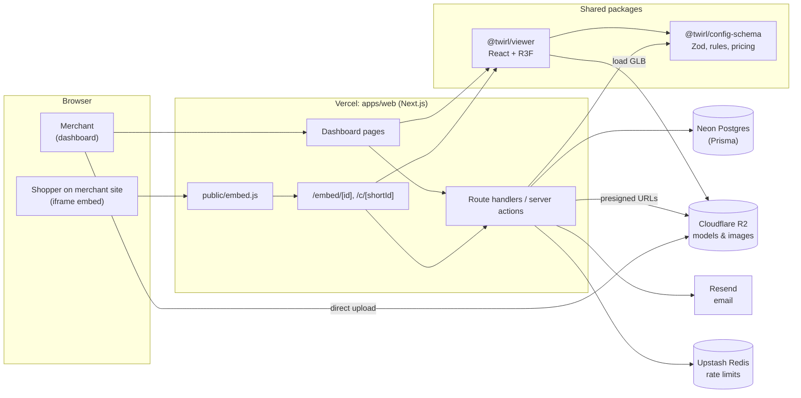
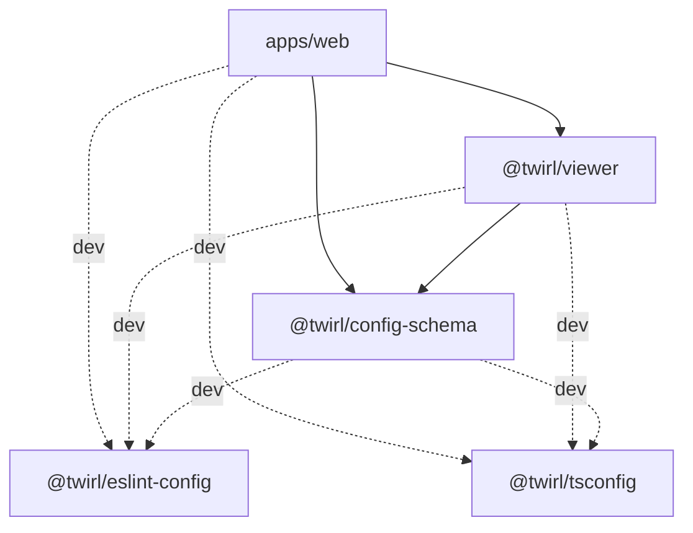
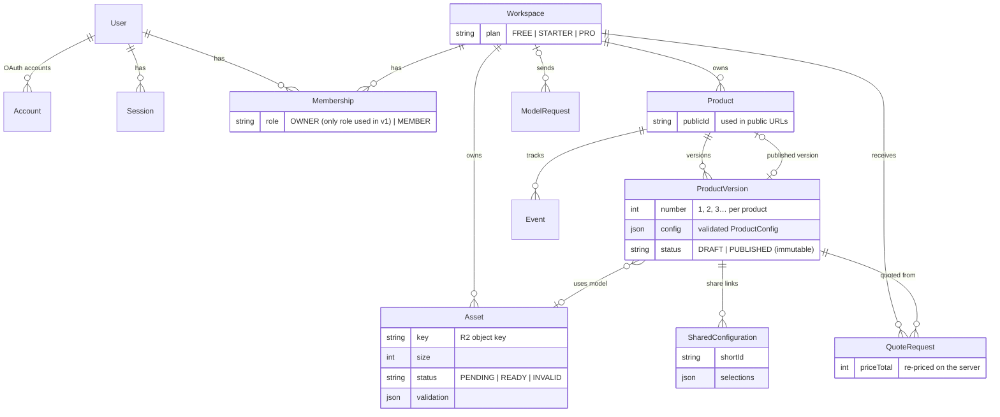
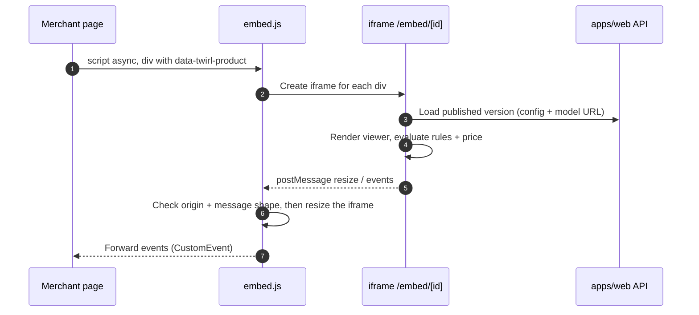

# Architecture

This document gives the big picture and is kept up to date as milestones land. Decisions and their
reasoning live in the [ADRs](adr/). Sections marked **Planned** describe the intended design from
the product spec; they become **Implemented** when the code exists and may change along the way.

| Area                                | Status           |
| ----------------------------------- | ---------------- |
| Monorepo, tooling, CI               | Implemented (M0) |
| Viewer (scene, parts, HDRIs), /demo | Implemented (M1) |
| Config, rules, pricing              | Planned (M2)     |
| Accounts, data, plans               | Planned (M3)     |
| Uploads, editor, publish            | Planned (M4)     |
| Embed, share links, export          | Planned (M5)     |
| Leads, events                       | Planned (M6)     |

## System overview



Key properties:

- **Model files never pass through Vercel functions.** Their request bodies are limited to about
  4.5 MB, while models can be up to 15 MB. The browser uploads straight to R2 using a presigned
  URL, and the viewer loads models straight from R2.
- **One rules/pricing implementation.** `@twirl/config-schema` computes the live price in the
  browser, and the server recomputes it from the stored, immutable version before accepting a
  quote.
- **The viewer is portable.** It receives a config, a model URL and selections, renders them, and
  reports events through callbacks. No Next.js, DB or auth imports (lint-enforced; see
  [ADR-0001](adr/0001-monorepo.md)).

## Package dependencies (Implemented)



## Data model (Implemented)

Prisma schema: `apps/web/prisma/schema.prisma`. Decisions: [ADR-0007](adr/0007-data-model.md).



Auth.js's `VerificationToken` stands alone.

## Upload flow (Implemented)

The same dependency-free inspector (`apps/web/src/lib/model-report.ts`) reads the model in the
browser before upload and on the server afterwards. The server's report is the one stored.
Decisions: [ADR-0010](adr/0010-uploads.md).

```mermaid
sequenceDiagram
  autonumber
  actor M as Merchant browser
  participant API as apps/web API
  participant R2 as Cloudflare R2
  participant DB as Postgres

  M->>M: Check + inspect locally (type, ≤ 15 MB, parses, ≥ 1 mesh, supported extensions)
  M->>API: POST /api/assets (filename, size)
  API->>API: Session + workspace, same-origin check, Zod
  API->>DB: Create Asset (status = PENDING)
  API-->>M: Presigned PUT URL (10 min; type and exact size signed)
  M->>R2: PUT file directly (bypasses Vercel)
  M->>API: POST /api/assets/:id/complete
  API->>R2: HEAD object (size, content type), then GET bytes
  API->>API: Inspect model → validation report
  API->>DB: Asset READY + report (or INVALID + report, object deleted)
  API-->>M: Status + report
```

## Embed flow (Planned, M5)



`/embed/*` may be framed by any site. Every other route sends headers that forbid framing.
